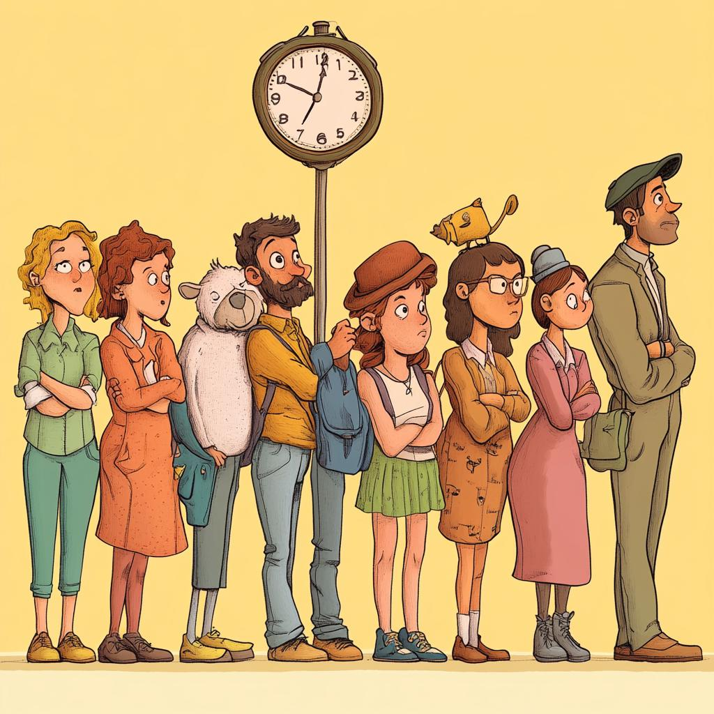

# Waiter

Go package waiter implements an object for waiting a specified delay
time since the last call before calling the next function. This is useful
when needing to call some code with a rate limit.

## Where to use

For example, if you need to call a function at a rate of 1 per second, you
can use a Waiter with a delay of 1 second. This can be useful in cases where
you need to call some API endpoint at a certain rate set by the API provider.

## Usage example

## Licence

[BSD](LICENSE)
